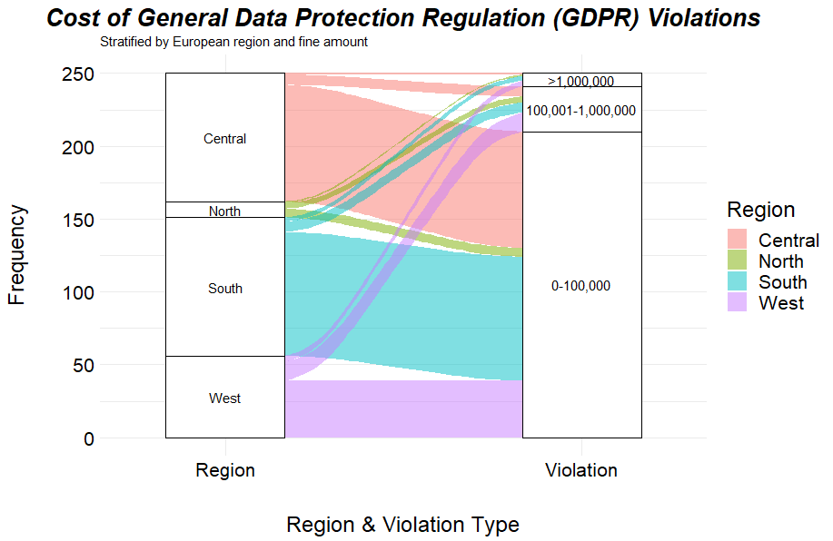
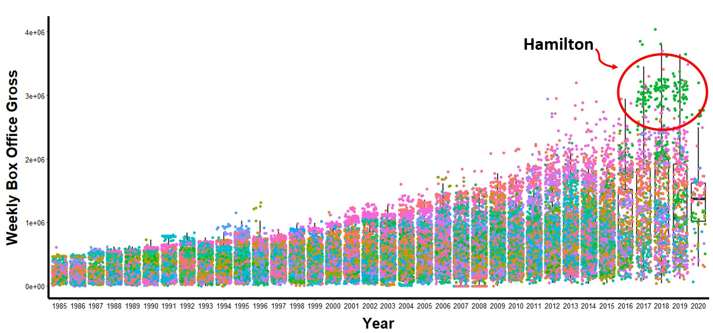
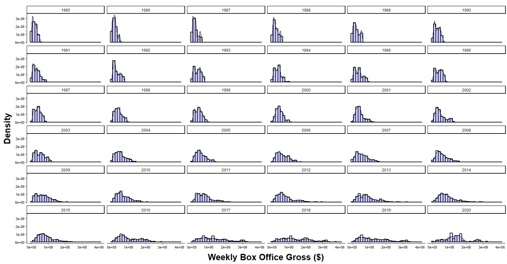
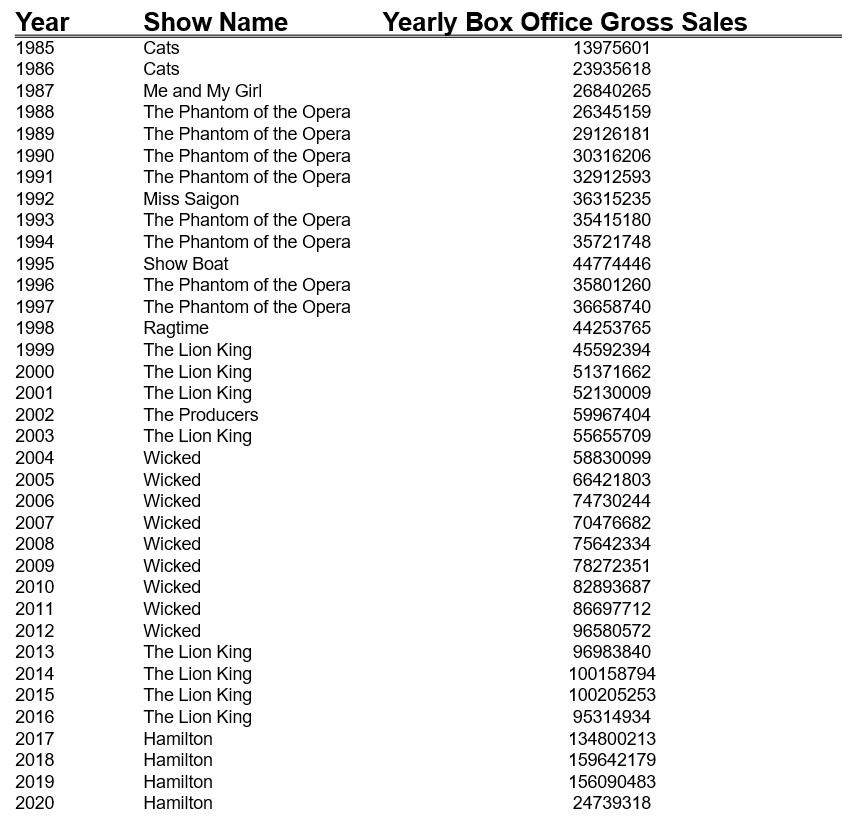
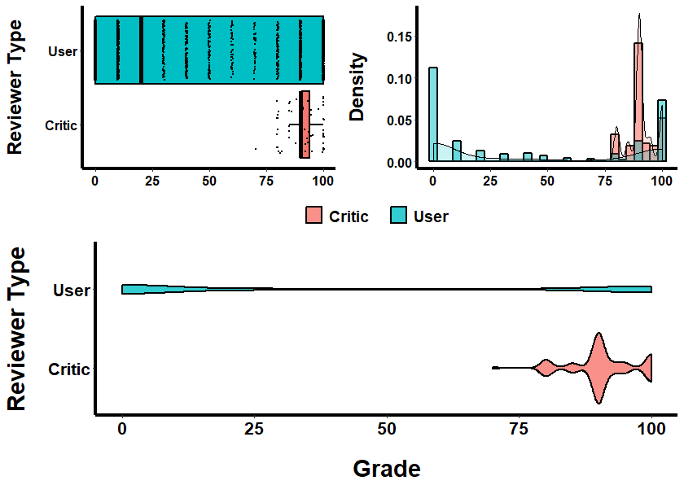
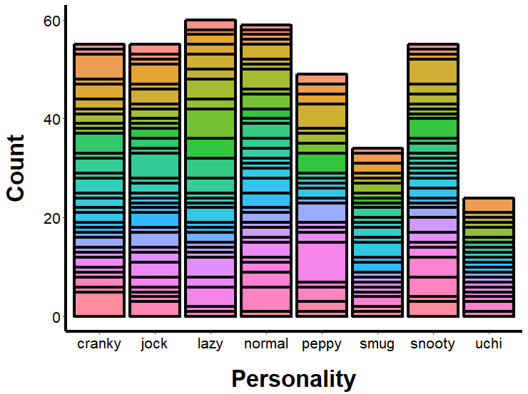
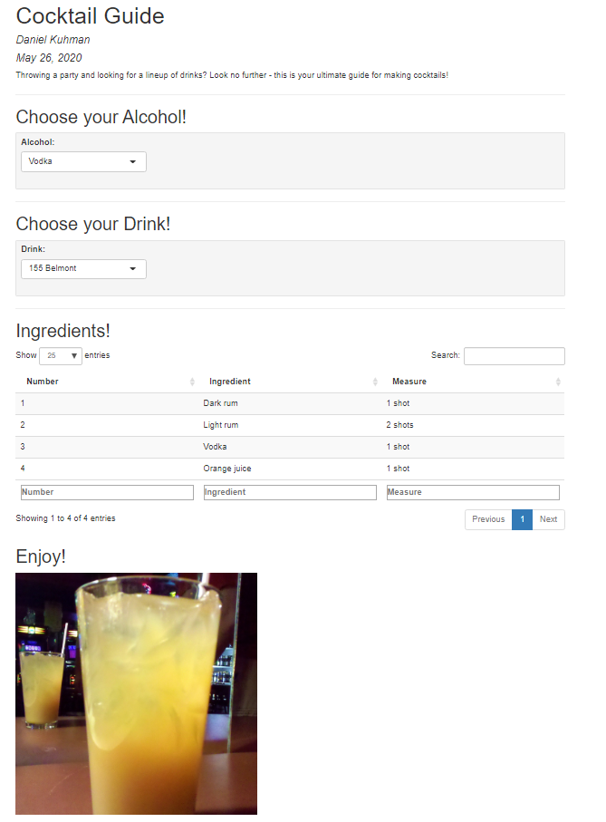

# TidyTuesday
TidyTuesday is hosted by the "R for Data Science online learning community" (https://github.com/rfordatascience). It's a fun way to sharpen up your R skills, especially data wrangling and visualization!

---
## April 21, 2020
**Description:** This data set included instances of GDPR (General Data Protection Regulation) fines delivered to members of the European Union. 

**What I did:** I grouped individual EU members into European regions, grouped fines by amount, and then used an alluvial plot to visualize the relationships between European region and fine amount. 

**Libraries used:** tidyverse, ggplot2, ggalluvial

**Final output:**

**What I learned:** This was my first time using alluvial plots - cool way to look at relationships between multiple categorical variables! It can get messy with too many variables or too many levels within one variable. 

---
## April 28, 2020
**Description:** This was a huge data set containing box office numbers (tickets sold, average ticket price, theater capacity, show name, show date, etc.) from Broadway theaters. 

**What I did:** I first looked at weekly box office sales (across all shows per week, grouped across all weeks in a year) across all years included in the data set. I plotted these as a box plot and added individual data points, colored by show name. This revealed that the top shows tend to rise above the rest and maintain their top postion across multiple years. This also revealed that the distribution of sales between shows appeared to increase in more recent years. To explore this further, I used facet wrap to plot sale distributions across years and found that, as expected, the distributions have flattened in recent years. Finally, I created a table with the top earning shows from each year - wow, some of these shows make a lot of money! 

**Libraries used:** tidyverse, ggplot2, stargazer

**Final output:**

 

**What I learned:** This was my first time using stargazer - I am still struggling with this. It produces html and then you modify the html outside of R? I need to spend more time playing with it. This was also my first time using facet_wrap to subplot based on a grouping variable. 

---
## May 5, 2020
**Description:** This is review and game data from the new Animal Crossing. 

**What I did:** I first compared the game's ratings from "critics" with ratings from users. While critics overwhelmingly scored the game high (mean = 90.6 out of 100), users were more hit-or-miss, with high densities of scores 2 > x > 8. I then explored character personalities, which were seaparated into 8 factor levels. I qualitatively determined that the number of game characters with each personality type is roughly the same (exception: smug) and that the number of animal species that make up each personality are roughly even.  

**Libraries used:** tidyverse, ggplot2, ggpubr

**Final output:**

 

**What I learned:** This was my first time using ggpubr to add multiple plots to a single figure. The ggarange function is relatively easy to use, but some aspects of it are not intuitive. 

---
## May 26, 2020
**Description:** This dataset included a long list of cocktails and their ingredients.

**What I did:** I created a simple Shiny App that allows the user to select an alcohol type (vodka, whiskey, tequila, rum, gin) and the drinks which use that alcohol type. After the user selects and alcohol type and associated drink, a table with the ingredients and an image of the drink appears on the screen.

**Libraries used:** tidyverse, shiny

**Final output:**

**What I learned:** This served as a nice re-introduction to R Shiny Apps for me. I had worked with these ~2 years ago and have not done much with them since. 
